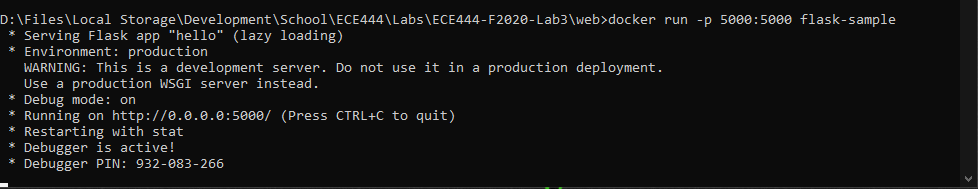
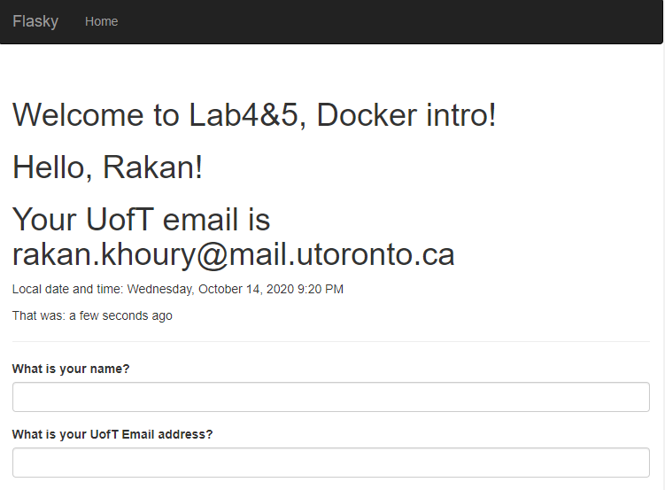
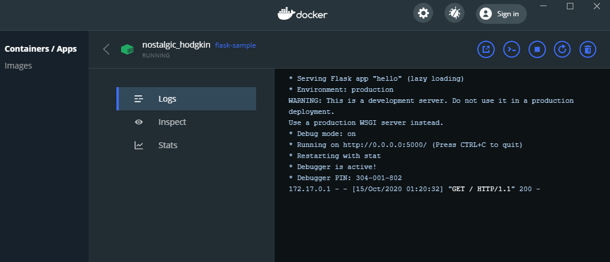
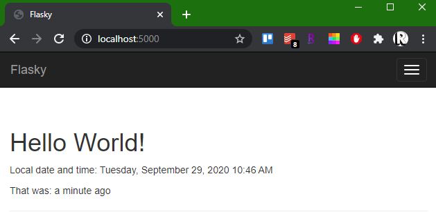
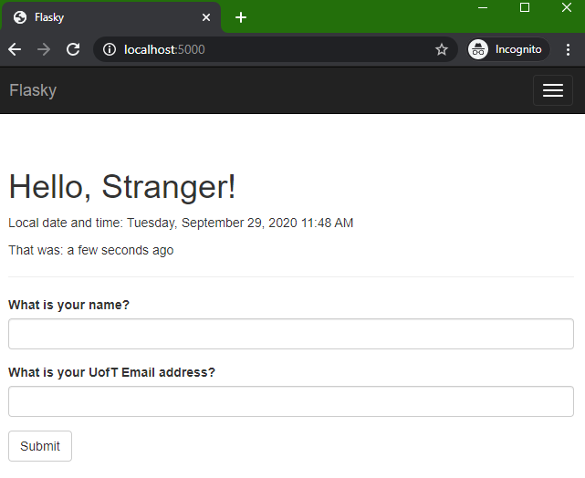
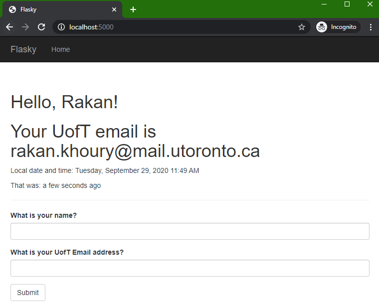
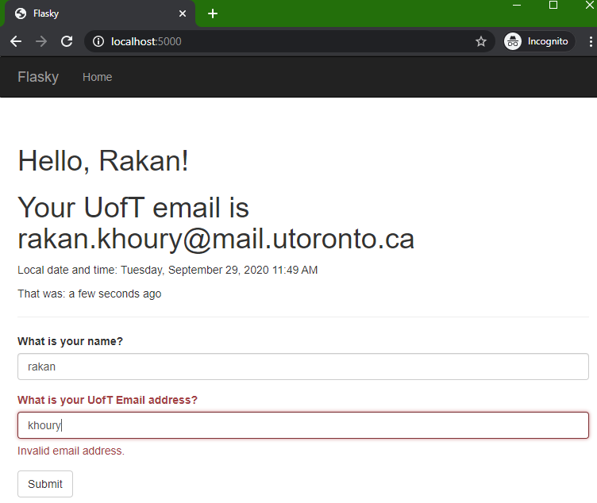
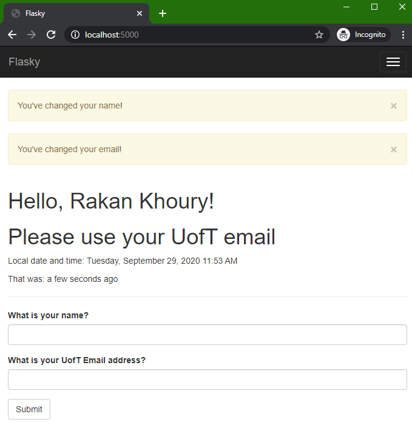

# ECE444-F2020-Lab3

This repo is a clone of https://github.com/miguelgrinberg/flasky

## Lab 4:
To build:
- open cmd in web folder
- "docker build -t flask-sample:latest ."

To run:
- "docker run -p 5000:5000 flask-sample" 
OR
- open docker desktop -> Images -> flask-sample -> run

While virtual machines get their own set of resources with more isolation but higher cost (a whole operating system), docker allows you to create containers that are lighter and built from images that can be distributed across systems. These containers are stand-alone executable packages that include everything that is needed to run the software.

## Lab 3:

### Activity 1:

### Activity 2:

### Activity 3:
SQL databases are based on a relational model wherin tables are stored with information about different entities, with records (rows) representing different instances of that entity. Relationships between the tables can then be established to link the entities together. This database typically uses SQL (structured query language) as it is a relational based language.

NoSQL databases do not folow a relational model. Instead, the common organization is as collections instead of tables, with documents replacing the record. This database forgoes the relational structure in favour of duplicating data, allowing for faster queries since no joins must be performed. 

